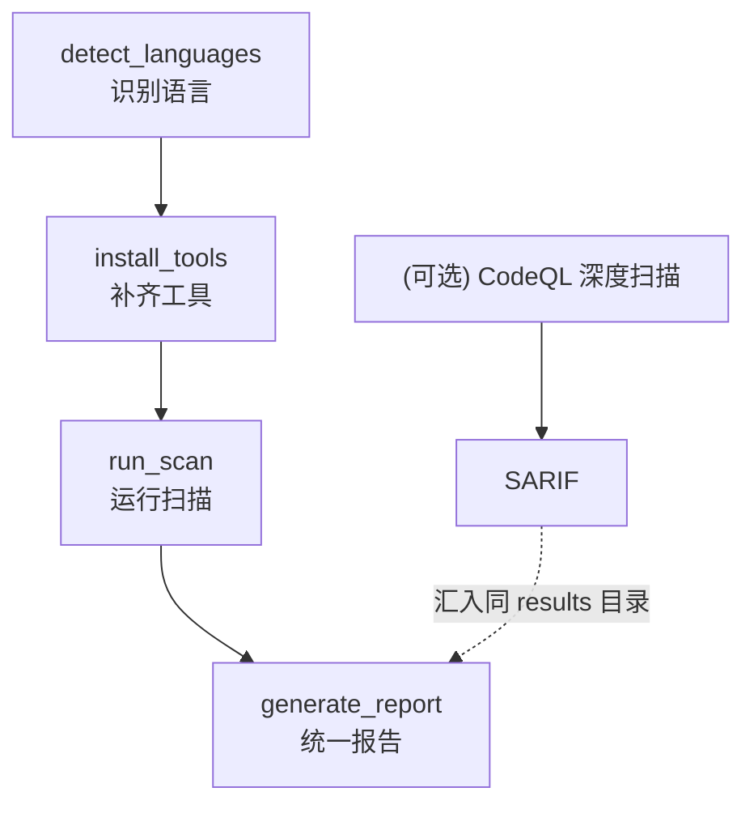

# Tiangang (天罡) —— SAST 静态应用安全测试套件

中文 | [English](README_EN.md)

[](https://github.com/Kirky-X/tiangang/releases) [](LICENSE)

Tiangang 是一个面向 AI agent 的 SAST(static application security testing)skill,采用 agent-first 格式(YAML frontmatter + Markdown 工作流说明)。它通过四个脚本构成一条完整流水线:`detect_languages` 自动识别目标目录的语言,`install_tools` 检查并补齐缺失扫描器,`run_scan` 运行 Semgrep(语言无关,始终运行)+ 各语言专属扫描器,`generate_report` 将多种异构格式(SARIF/JSON/XML)统一为一份人类可读的 Markdown 报告。

**核心理念**:每一种语言都有专门的工具是有原因的 —— Bandit 知道 Python 的 `pickle`/`eval` 陷阱,Gosec 知道 Go 特有的 SQL 注入模式。试图通过人工读代码复现这些工具的覆盖面,会错过它们自动捕获的问题。**用工具、读输出、解释输出**,而非用肉眼审查代码冒充 SAST。

四个步骤映射到 `scripts/` 中的四个脚本,各步骤输出作为下一步输入。完整工作流与路由表见 [SKILL.md](SKILL.md)。

## 功能特性

- **10 种语言专属扫描器** —— 每种语言都有目的构建的工具，而非通用规则套用:
  - Python → **Bandit**
  - Java → **FindSecBugs**（Maven/Gradle 集成）
  - Go → **Gosec**
  - C/C++ → **Flawfinder** + **Cppcheck**
  - Ruby → **Brakeman**（Rails 专用）
  - PHP → **Psalm**（composer 集成）
  - .NET → **Security Code Scan**（Roslyn 分析器）
  - Rust → **cargo-audit** + **Miri**
  - JavaScript/TypeScript → **njsscan** + **retire.js** + **eslint-plugin-security**
  - IaC（基础设施即代码）→ **checkov** + **tfsec**（Terraform/K8s/Docker/CloudFormation）
- **通用 SCA + 密钥扫描通道** —— 无论检测到哪些语言都运行(吸收自 strix source-aware SAST playbook):
  - **Trivy** —— 全生态依赖 CVE 扫描,覆盖 npm/pip/go/cargo/maven 等主流生态;DB 陈旧信号物化到 `trivy-version.json`,零结果不再误导为"安全"
  - **Gitleaks** + **Trufflehog** —— 独立密钥扫描双通道,与 Semgrep `p/secrets` 规则集解耦(单一通道 = 单点失败);parser 层切断 secret-on-disk 路径,`Secret`/`Match`/`Raw`/`Redacted` 原文绝不进报告
- **2 种通用 SAST 扫描器** —— 语言无关,覆盖跨语言模式:
  - **Semgrep** —— 始终运行,捕获硬编码密钥、不安全反序列化等模式
  - **CodeQL** —— 可选深度扫描,需构建查询数据库,见 `references/codeql.md`
- **4 步工作流** —— 检测 → 安装 → 扫描 → 报告,各步骤输出作为下一步输入
- **多语言项目支持** —— 自动发现所有语言(如 Python 后端 + Go sidecar),全部扫描而非只扫主导语言
- **统一报告** —— 多种工具的异构输出格式(SARIF/JSON/XML/JSONL)归并为一份按严重级别分组的 Markdown 报告
- **CI/CD 原生集成** —— `--ci` 模式输出 GitHub Actions annotations,`--gate` 门禁阈值控制阻断级别
- **增量扫描** —— `--diff-only` 只扫描 git 变更文件,文件哈希缓存避免重复扫描
- **多格式报告输出** —— `--format md|html|json|all` 支持 Markdown/HTML/JSON 三种报告格式
- **跨工具 Finding 关联** —— 三层去重(精确匹配 + CWE 同位置 + 邻近行) + 多工具确认标记
- **Secret 检测增强** —— 支持阿里云/腾讯云/OpenAI/数据库连接串等新增模式 + Shannon 熵值兜底检测
- **LLM 误报过滤** —— `--triage` 生成 LLM 分类提示词,用于 false positive 评估
- **扫描趋势追踪** —— `--trend` 显示与历史扫描的对比,发现增减趋势
- **插件化架构** —— `ToolPlugin` 基类支持扩展新扫描器而无需修改核心调度逻辑
- **失败显性化** —— 工具缺失、安装失败、扫描被跳过都会在报告中明确标注原因,而非静默“成功”
- **清洁扫描不等于安全** —— 报告中明确区分"实际检查范围"与"无漏洞保证",避免误导

## 安装

### 方式一:通过 `skills` 包安装(推荐)

需 [Node.js](https://nodejs.org/) 18+ 和 `skills` npm 包(v1.5.12+)。`skills` 是 open agent skills 生态的 CLI,支持 68+ agents(Claude Code / Trae / Cursor / Codex / OpenCode 等)。

```bash
# 安装到 Claude Code
npx skills add https://github.com/Kirky-X/tiangang.git --agent claude-code -y

# 等价简写(owner/repo)
npx skills add Kirky-X/tiangang --agent claude-code -y

# 安装到 Trae
npx skills add Kirky-X/tiangang --agent trae -y

# 列出仓库中可被发现的所有 skills(不安装)
npx skills add https://github.com/Kirky-X/tiangang.git --list
```

安装后 skill 文件位于对应 agent 的 skills 目录(如 `.claude/skills/tiangang/`)。

### 方式二:传统 git clone

```bash
git clone https://github.com/Kirky-X/tiangang.git
# 将 SKILL.md + references/ + scripts/ 链接或复制到 agent skills 目录
# 各 runtime 的 skills 目录路径示例(任选其一):
#   Claude Code:  ~/.claude/skills/tiangang/
#   Trae:         ~/.trae-cn/skills/tiangang/
#   Cursor:       ~/.cursor/skills/tiangang/
#   Codex:        ~/.codex/skills/tiangang/
```

## 使用示例

Tiangang 作为 skill 被 agent 加载后,通过自然语言意图触发,无需显式命令。典型触发语:

| 用户意图 | 触发关键词 |
| -------- | ---------- |
| 安全审计 / 安全审查 | "security audit"、"安全审查"、"安全审计" |
| 漏洞扫描 | "vulnerability scan"、"漏洞扫描"、"检查漏洞" |
| SAST 扫描 | "SAST scan"、"静态安全扫描" |
| 发布前检查 | "release check"、"发布前安全检查"、"上线前扫描" |
| 特定漏洞排查 | "硬编码密钥"、"SQL 注入"、"不安全 eval"、"反序列化"、"缓冲区溢出" |
| 语言工具查询 | "我的项目该用哪些安全工具" |

### 四步工作流

```bash
# 1. 检测语言(也可跳过此步,直接在下一步传 --langs)
python3 scripts/detect_languages.py <target-dir> --json

# 2. 安装缺失工具(安全可重跑,只装缺的)
bash scripts/install_tools.sh <lang1> <lang2> ...
# 或一次性安装所有支持的工具:
bash scripts/install_tools.sh all

# 3. 运行扫描(Semgrep 始终运行 + 各语言专属工具)
python3 scripts/run_scan.py <target-dir> [--out <results-dir>] [--langs python,go,...]
# CI 模式:退出码反映 finding 严重级别,输出 GitHub Actions annotations
python3 scripts/run_scan.py <target-dir> --ci --gate high
# 增量模式:只扫描自上次提交以来变更的文件
python3 scripts/run_scan.py <target-dir> --diff-only --since HEAD~1

# 4. 生成统一报告(支持多种格式)
python3 scripts/generate_report.py <results-dir> [--out report.md] [--format md|html|json|all]
# 包含趋势对比
python3 scripts/generate_report.py <results-dir> --trend
# 生成 LLM 误报过滤提示词
python3 scripts/generate_report.py <results-dir> --triage
```

### 典型场景

**单语言项目快速扫描**:

> "帮我扫描这个 Python 项目的代码安全问题"

agent 路由 → 检测语言 → 安装 Bandit/Semgrep → 运行扫描 → 产出统一报告 → 主动解释 Critical/High 级别发现的漏洞模式(如 SQL 注入、pickle 反序列化、eval 滥用)。

**多语言项目 + CodeQL 深度扫描**:

> "对 /path/to/repo 做一次彻底的安全审计,包含 CodeQL 深度扫描"

agent 识别为多步任务 → 自动发现多语言 → 并行安装 Bandit/Gosec/Semgrep → 运行扫描 → 读取 `references/codeql.md` 走独立 CodeQL 流程(数据库构建 → 安全查询套件)→ 汇总所有 SARIF/JSON → 报告中标注 CodeQL 与各工具覆盖范围及未运行工具原因。

## 能力概览

### `references/` —— 工具表与深度流程

| 文件                              | 内容                                                                |
| --------------------------------- | ------------------------------------------------------------------- |
| [`tools.md`](references/tools.md) | 全语言工具表:工具名、检测信号、安装命令、扫描命令、输出格式        |
| [`codeql.md`](references/codeql.md) | 独立的 CodeQL 深度流程:CLI 安装、数据库构建、安全查询套件运行(仅在用户请求深度扫描时读取) |

### `scripts/` —— 四步工作流

| 脚本                                                              | 步骤                                                  |
| ----------------------------------------------------------------- | ----------------------------------------------------- |
| [`detect_languages.py`](scripts/detect_languages.py)              | 步骤 1:遍历目标目录,通过 manifest 文件 + 扩展名计数识别语言 |
| [`install_tools.sh`](scripts/install_tools.sh)                    | 步骤 2:`command -v` 检查后只装缺失工具,安全可重跑      |
| [`run_scan.py`](scripts/run_scan.py)                              | 步骤 3:运行 Semgrep(始终)+ 各语言专属扫描器,写 SARIF/JSON |
| [`generate_report.py`](scripts/generate_report.py)                | 步骤 4:解析所有原始输出为统一 Markdown 报告(按严重级别分组)|

### `test-prompts.json` —— 4 个验证用例

覆盖典型单语言场景、多语言 + 深度扫描场景、工具缺失失败显性化场景、清洁扫描 ≠ 安全的反误导场景。

## 完整流程链路



1. `detect_languages` 通过 manifest 文件(`requirements.txt`、`go.mod`、`Cargo.toml` 等,强信号)+ 扩展名计数(弱信号,经最低文件数阈值过滤)返回所有高于噪声阈值的语言
2. `install_tools` 检查每个相关工具,只安装缺失的;对于无法自动安装的工具(FindSecBugs / Security Code Scan / Psalm)打印操作指引而非静默跳过
3. `run_scan` 始终运行 Semgrep(语言无关,捕获硬编码密钥等跨语言模式)+ 通用 SCA/密钥扫描通道(trivy/gitleaks/trufflehog,无论检测到哪些语言都运行)+ 步骤 2 中可用的语言专属工具;写每个工具的原始输出与 `scan_manifest.json`(记录已运行/已跳过工具)
4. `generate_report` 将 SARIF / Bandit JSON / Cppcheck XML / cargo-audit JSON / Trivy JSON / Gitleaks JSON / Trufflehog JSONL / Retire JSON 等异构格式解析为统一 Markdown:按严重级别的汇总表 + 未运行工具及原因清单 + 按严重级别再按文件分组的发现列表。密钥扫描通道的 parser 在 message 中只保留 rule id / detector name,凭证原文(`Secret`/`Match`/`Raw`/`Redacted`)绝不进报告 —— `redact.py` 是 defense in depth

## FAQ

### 哪些工具无法自动安装?

三种工具需要项目特定集成而非独立 CLI,`install_tools.sh` 会打印操作指引而非静默跳过:

- **FindSecBugs**(Java)—— 需添加到项目的 Maven/Gradle build,或对已编译的 `.class` 文件运行
- **Security Code Scan**(.NET)—— 是通过 `dotnet add package` 添加的 Roslyn 分析器
- **Psalm**(PHP)—— 需要已有的 `composer.json` 才能挂入

遇到这些工具时,agent 应主动提议协助修改 build 文件,而非留下一个用户必须回头处理的手动步骤。

### CodeQL 为什么不包含在 `run_scan` 步骤中?

CodeQL 需要先构建编译查询数据库,且明显更慢 —— 把它当作可选的深度扫描。当用户请求"深度"或"彻底"审计,或明确点名 CodeQL 时,读取 `references/codeql.md` 并单独运行该流程,将其 SARIF 输出写入同一 results 目录后再生成报告。

### 扫描结果显示"无问题"代表代码安全吗?

**不。** 报告会明确区分"实际检查范围"与"无漏洞保证":列出实际运行的工具与覆盖的语言/漏洞类型,指出未安装或未运行工具造成的覆盖缺口。清洁扫描反映的是这些工具的覆盖范围,而非无漏洞的保证。需要补强可追加 CodeQL 深度扫描。

### `skills add` 提示 "Installation complete" 但 `.claude/skills/tiangang/` 不存在?

这是 `skills` 包的已知问题:命令报告成功但未实际复制文件。**Workaround**:手动复制 skill 文件到 agent skills 目录:

```bash
# Claude Code
mkdir -p ~/.claude/skills/tiangang
cp -r SKILL.md skill.json references scripts ~/.claude/skills/tiangang/

# Trae
mkdir -p ~/.trae-cn/skills/tiangang
cp -r SKILL.md skill.json references scripts ~/.trae-cn/skills/tiangang/

# Cursor
mkdir -p ~/.cursor/skills/tiangang
cp -r SKILL.md skill.json references scripts ~/.cursor/skills/tiangang/

# Codex
mkdir -p ~/.codex/skills/tiangang
cp -r SKILL.md skill.json references scripts ~/.codex/skills/tiangang/
```

## 许可证

MIT
