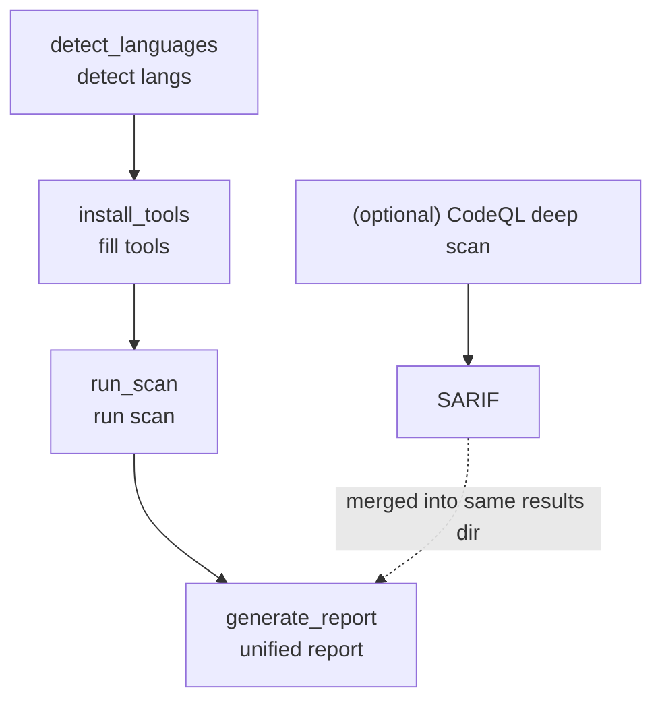

# Tiangang (天罡) — SAST Static Application Security Testing Suite

[中文](README.md) | English

[](https://github.com/Kirky-X/tiangang/releases) [](LICENSE)

Tiangang is an AI-agent-oriented SAST (static application security testing) skill in agent-first format (YAML frontmatter + Markdown workflow notes). It builds a complete pipeline out of four scripts: `detect_languages` auto-identifies the target directory's languages, `install_tools` checks and fills in any missing scanners, `run_scan` runs Semgrep (language-agnostic, always on) plus per-language scanners, and `generate_report` unifies heterogeneous formats (SARIF/JSON/XML) into one human-readable Markdown report.

**Core philosophy**: Every language has a purpose-built tool for a reason — Bandit knows Python's `pickle`/`eval` footguns, Gosec knows Go's specific SQL-injection patterns, and so on. Trying to replicate that coverage by reading code manually misses things these tools catch automatically. **Use the tools; read their output; explain it** — don't eyeball files and call it SAST.

The four steps map to four scripts under `scripts/`, each one's output feeding the next. Full workflow and routing table are in [SKILL.md](SKILL.md).

## Features

- **10 language-specific scanners** — purpose-built tools per language, not generic rules:
  - Python → **Bandit**
  - Java → **FindSecBugs** (Maven/Gradle integration)
  - Go → **Gosec**
  - C/C++ → **Flawfinder** + **Cppcheck**
  - Ruby → **Brakeman** (Rails-specific)
  - PHP → **Psalm** (composer integration)
  - .NET → **Security Code Scan** (Roslyn analyzer)
  - Rust → **cargo-audit** + **Miri**
  - JavaScript/TypeScript → **njsscan** + **retire.js** + **eslint-plugin-security**
- **Universal SCA + secret scanning channel** — runs on every scan regardless of detected language (absorbed from strix's source-aware SAST playbook):
  - **Trivy** — full-ecosystem dependency CVE scan (npm/pip/go/cargo/maven); DB staleness signal materialized to `trivy-version.json`, so a zero-result scan no longer masquerades as "secure" when the DB is stale
  - **Gitleaks** + **Trufflehog** — independent dual-channel secret scanning, decoupled from Semgrep's `p/secrets` ruleset (single channel = single point of failure); parsers strip `Secret`/`Match`/`Raw`/`Redacted` from finding messages so credentials never land on disk in the report
- **2 universal SAST scanners** — language-agnostic, covering cross-language patterns:
  - **Semgrep** — always runs; catches hardcoded secrets, unsafe deserialization, etc.
  - **CodeQL** — optional deep pass; needs a compiled query database, see `references/codeql.md`
- **4-step workflow** — Detect → Install → Scan → Report, each step's output feeds the next
- **Multi-language project support** — auto-discovers all languages (e.g. Python backend + Go sidecar) and scans all of them, not just the dominant one
- **Unified report** — heterogeneous outputs from many tools (SARIF/JSON/XML/JSONL) merged into one Markdown report grouped by severity
- **CI/CD native integration** — `--ci` mode outputs GitHub Actions annotations, `--gate` threshold controls blocking severity
- **Incremental scanning** — `--diff-only` scans only git-changed files, file hash cache avoids redundant scans
- **Multi-format report output** — `--format md|html|json|all` supports Markdown, HTML, and JSON report formats
- **Cross-tool finding correlation** — three-tier dedup (exact + CWE same-location + proximity) + multi-tool confirmation tags
- **Enhanced secret detection** — new patterns for Alibaba Cloud/Tencent Cloud/OpenAI/DB connection strings + Shannon entropy fallback
- **LLM false positive filtering** — `--triage` generates LLM classification prompt for triage assessment
- **Scan trend tracking** — `--trend` shows comparison with historical scans, revealing trends
- **Plugin architecture** — `ToolPlugin` base class for extending with new scanners without modifying core dispatch
- **Fail loud** — missing tools, install failures, and skipped scans are explicitly noted with reasons in the report, not silently "successful"
- **Clean scan ≠ secure** — the report explicitly distinguishes "what was actually checked" from "guarantee of no vulnerabilities" to avoid misleading users

## Installation

### Option 1: Install via the `skills` package (recommended)

Requires [Node.js](https://nodejs.org/) 18+ and the `skills` npm package (v1.5.12+). `skills` is the CLI of the open agent skills ecosystem, supporting 68+ agents (Claude Code / Trae / Cursor / Codex / OpenCode, etc.).

```bash
# Install into Claude Code
npx skills add https://github.com/Kirky-X/tiangang.git --agent claude-code -y

# Equivalent shorthand (owner/repo)
npx skills add Kirky-X/tiangang --agent claude-code -y

# Install into Trae
npx skills add Kirky-X/tiangang --agent trae -y

# List all discoverable skills in the repo (without installing)
npx skills add https://github.com/Kirky-X/tiangang.git --list
```

After installation, skill files live in the agent's skills directory (e.g. `.claude/skills/tiangang/`).

### Option 2: Traditional git clone

```bash
git clone https://github.com/Kirky-X/tiangang.git
# Link or copy SKILL.md + references/ + scripts/ into the agent skills directory
# Example paths per runtime (pick one):
#   Claude Code:  ~/.claude/skills/tiangang/
#   Trae:         ~/.trae-cn/skills/tiangang/
#   Cursor:       ~/.cursor/skills/tiangang/
#   Codex:        ~/.codex/skills/tiangang/
```

## Usage examples

Once loaded as a skill, Tiangang is triggered by natural-language intent — no explicit commands needed. Typical triggers:

| User intent | Trigger keywords |
| ----------- | ----------------- |
| Security audit / review | "security audit", "安全审查", "安全审计" |
| Vulnerability scan | "vulnerability scan", "漏洞扫描", "check for vulnerabilities" |
| SAST scan | "SAST scan", "静态安全扫描" |
| Pre-release check | "release check", "pre-deploy security check", "上线前扫描" |
| Specific issue hunt | "hardcoded secrets", "SQL injection", "unsafe eval", "deserialization", "buffer overflow" |
| Language tool query | "which security tools apply to my project's language" |

### Four-step workflow

```bash
# 1. Detect languages (can be skipped by passing --langs to the next step)
python3 scripts/detect_languages.py <target-dir> --json

# 2. Install missing tools (idempotent — only installs what's missing)
bash scripts/install_tools.sh <lang1> <lang2> ...
# Or install every supported tool at once:
bash scripts/install_tools.sh all

# 3. Run the scan (Semgrep always on + per-language tools)
python3 scripts/run_scan.py <target-dir> [--out <results-dir>] [--langs python,go,...]
# CI mode: exit code reflects finding severity, outputs GitHub Actions annotations
python3 scripts/run_scan.py <target-dir> --ci --gate high
# Incremental mode: only scan files changed since a git ref
python3 scripts/run_scan.py <target-dir> --diff-only --since HEAD~1

# 4. Generate the unified report (multiple formats supported)
python3 scripts/generate_report.py <results-dir> [--out report.md] [--format md|html|json|all]
# Include trend comparison with previous scans
python3 scripts/generate_report.py <results-dir> --trend
# Generate LLM triage prompt for false positive assessment
python3 scripts/generate_report.py <results-dir> --triage
```

### Typical scenarios

**Quick scan of a single-language project**:

> "Scan this Python project for security issues."

Agent routes → detects language → installs Bandit/Semgrep → runs scan → produces unified report → proactively explains Critical/High findings' vulnerability patterns (e.g. SQL injection, pickle deserialization, eval misuse).

**Multi-language project + CodeQL deep scan**:

> "Do a thorough security audit of /path/to/repo, including a CodeQL deep scan."

Agent recognizes multi-step task → auto-discovers multiple languages → installs Bandit/Gosec/Semgrep in parallel → runs scan → reads `references/codeql.md` for the separate CodeQL flow (database build → security query suite) → merges all SARIF/JSON → notes CodeQL coverage and reasons for any tools that didn't run.

## Capability overview

### `references/` — Tool tables and deep flows

| File                              | Contents                                                                |
| --------------------------------- | ------------------------------------------------------------------- |
| [`tools.md`](references/tools.md) | Full per-language tool table: tool name, detection signal, install command, scan command, output format |
| [`codeql.md`](references/codeql.md) | Separate, heavier CodeQL flow: CLI setup, database creation, running the security query suite (read only when doing a deep/opt-in scan) |

### `scripts/` — Four-step workflow

| Script                                                            | Step                                                  |
| ----------------------------------------------------------------- | ----------------------------------------------------- |
| [`detect_languages.py`](scripts/detect_languages.py)              | Step 1: walk the target dir, identify languages via manifest files + extension counts |
| [`install_tools.sh`](scripts/install_tools.sh)                    | Step 2: `command -v` check, only install what's missing; safe to re-run |
| [`run_scan.py`](scripts/run_scan.py)                              | Step 3: run Semgrep (always) + per-language scanners; write SARIF/JSON |
| [`generate_report.py`](scripts/generate_report.py)                | Step 4: parse all raw outputs into a unified Markdown report grouped by severity |

### `test-prompts.json` — 4 validation cases

Covers a typical single-language case, a multi-language + deep-scan case, a fail-loud case for missing tools, and an anti-misleading "clean scan ≠ secure" case.

## Full pipeline



1. `detect_languages` returns every language above the noise threshold using manifest files (`requirements.txt`, `go.mod`, `Cargo.toml`, etc. — a strong signal) plus extension counts (a weaker signal, filtered by a minimum file count so a single stray script doesn't pull in an irrelevant tool)
2. `install_tools` checks each relevant tool and installs only what's missing; for tools that can't be auto-installed (FindSecBugs / Security Code Scan / Psalm) it prints what to do rather than silently skipping
3. `run_scan` always runs Semgrep (language-agnostic, catches cross-language patterns like hardcoded secrets) + the universal SCA/secret channel (trivy/gitleaks/trufflehog, runs regardless of detected language) + the language-specific tools available from step 2; writes each tool's raw output and a `scan_manifest.json` recording what ran and what was skipped
4. `generate_report` parses heterogeneous formats (SARIF / Bandit JSON / Cppcheck XML / cargo-audit JSON / Trivy JSON / Gitleaks JSON / Trufflehog JSONL / Retire JSON — extend `PARSERS` in the script if you wire in a new tool) into one Markdown: a summary table by severity, a list of any tools that didn't run and why, and findings grouped by severity then by file. Secret-channel parsers keep only rule id / detector name in finding messages — credential values (`Secret`/`Match`/`Raw`/`Redacted`) never enter the report; `redact.py` is defense in depth

## FAQ

### Which tools can't be auto-installed?

Three tools need project-specific wiring rather than a standalone CLI; `install_tools.sh` prints what to do rather than silently skipping:

- **FindSecBugs** (Java) — needs to be added to the project's Maven/Gradle build, or run against already-compiled `.class` files
- **Security Code Scan** (.NET) — is a Roslyn analyzer added via `dotnet add package`
- **Psalm** (PHP) — needs an existing `composer.json` to hook into

When these come up, the agent should offer to make the build-file edit for the user rather than leaving it as a manual step they have to come back to.

### Why isn't CodeQL part of the `run_scan` step?

CodeQL needs a compiled query database built first and is noticeably slower — treat it as an opt-in deep pass. When the user asks for a "deep" or "thorough" audit, or names CodeQL specifically, read `references/codeql.md` and run that flow separately, writing its SARIF output into the same results directory before generating the report.

### Does a clean scan mean the code is secure?

**No.** The report explicitly distinguishes "what was actually checked" from "guarantee of no vulnerabilities": it lists the tools that ran, the languages and vulnerability types they covered, and the coverage gaps from tools that couldn't be installed or didn't run. A clean scan reflects the coverage of those tools, not a guarantee of no vulnerabilities. CodeQL deep scan can be added to strengthen coverage.

### `skills add` reports "Installation complete" but `.claude/skills/tiangang/` doesn't exist?

This is a known issue with the `skills` package: the command reports success but doesn't actually copy files. **Workaround**: manually copy the skill files into the agent skills directory:

```bash
# Claude Code
mkdir -p ~/.claude/skills/tiangang
cp -r SKILL.md skill.json references scripts ~/.claude/skills/tiangang/

# Trae
mkdir -p ~/.trae-cn/skills/tiangang
cp -r SKILL.md skill.json references scripts ~/.trae-cn/skills/tiangang/

# Cursor
mkdir -p ~/.cursor/skills/tiangang
cp -r SKILL.md skill.json references scripts ~/.cursor/skills/tiangang/

# Codex
mkdir -p ~/.codex/skills/tiangang
cp -r SKILL.md skill.json references scripts ~/.codex/skills/tiangang/
```

## License

MIT
